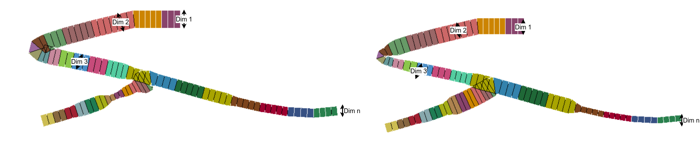
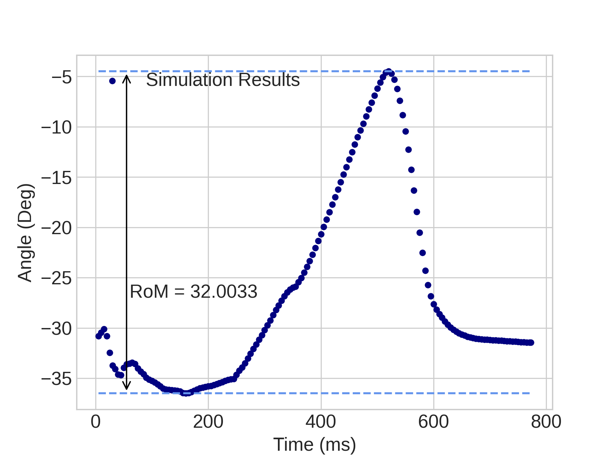

# Surrogate modelling for Ankle foot prosthesis

Regression tasks in Artificial Intelligence are not common, they are being used in fields as Finance, Surrogate Modelling [Forrester2008] and Sensitivity Analysis [Iooss2015].

The Design Variables in prosthesis have been studied along decades. Those variables can be grouped in the following according to [Hansen2016]:

- Siffness/Flexibility.
- Damping.
- Roll-over characteristics
- Active push-off in late stance phase

The half part of the course will do the design focused on the prosthesis stiffness, in other words, variation of the thickness along the laminates.The other half of the course will be focused on the Roll-over characteristics, this is achieved with variations in the prosthesis shape.

## Design for thickness

As it was explained, there are two datasets, those are simulations already performed with a Latin Hyper Cube (LHS) experiment \cite{Helton2003} design. The first one is about the influence of the thickness variation with respect to the outputs. For thickness 120 simulations were run, varying the thickness on different locations of the prosthesis. The following figure \ref{fig:thickness} explains how thickness is being varied along the device. In total, there are twelve dimensions as features for the dataset.




```python
import pandas as pd
Thickness_df = pd.read_csv('AnkleFoot_thickness.csv', index_col=0)
Thickness_df.index = Thickness_df['Experiment No.'].astype('int64') #Establiching index experiment
Thickness_df_df =  Thickness_df.drop(['Experiment No.'], axis=1) #Dropping index column
Thickness_df.head().iloc[:,:10]
```


<div>
<style scoped>
    .dataframe tbody tr th:only-of-type {
        vertical-align: middle;
    }

    .dataframe tbody tr th {
        vertical-align: top;
    }

    .dataframe thead th {
        text-align: right;
    }
</style>
<table border="1" class="dataframe">
  <thead>
    <tr style="text-align: right;">
      <th></th>
      <th>dim 1</th>
      <th>dim 2</th>
      <th>dim 3</th>
      <th>dim 4</th>
      <th>dim 5</th>
      <th>dim 6</th>
      <th>dim 7</th>
      <th>dim 8</th>
      <th>dim 9</th>
      <th>dim 10</th>
    </tr>
    <tr>
      <th>Experiment No.</th>
      <th></th>
      <th></th>
      <th></th>
      <th></th>
      <th></th>
      <th></th>
      <th></th>
      <th></th>
      <th></th>
      <th></th>
    </tr>
  </thead>
  <tbody>
    <tr>
      <th>1</th>
      <td>14.696</td>
      <td>19.446</td>
      <td>6.146</td>
      <td>2.346</td>
      <td>9.312</td>
      <td>10.737</td>
      <td>18.179</td>
      <td>2.029</td>
      <td>7.254</td>
      <td>9.471</td>
    </tr>
    <tr>
      <th>2</th>
      <td>10.262</td>
      <td>2.979</td>
      <td>10.262</td>
      <td>17.546</td>
      <td>10.896</td>
      <td>17.071</td>
      <td>10.104</td>
      <td>11.688</td>
      <td>8.046</td>
      <td>15.013</td>
    </tr>
    <tr>
      <th>3</th>
      <td>15.013</td>
      <td>9.629</td>
      <td>18.021</td>
      <td>8.679</td>
      <td>6.146</td>
      <td>19.921</td>
      <td>11.688</td>
      <td>15.329</td>
      <td>8.521</td>
      <td>15.487</td>
    </tr>
    <tr>
      <th>4</th>
      <td>9.629</td>
      <td>7.571</td>
      <td>1.396</td>
      <td>8.204</td>
      <td>17.229</td>
      <td>13.904</td>
      <td>1.238</td>
      <td>12.954</td>
      <td>5.196</td>
      <td>14.221</td>
    </tr>
    <tr>
      <th>5</th>
      <td>4.404</td>
      <td>3.771</td>
      <td>15.329</td>
      <td>18.654</td>
      <td>13.904</td>
      <td>10.896</td>
      <td>8.521</td>
      <td>18.338</td>
      <td>7.413</td>
      <td>1.871</td>
    </tr>
  </tbody>
</table>
</div>


The dimensions are given in mm. 

## Design for shape

On the other hand, we have manipulated the foot shape due to the control points in the cartesian space. The following figure indicates which dimension corresponds to each point:


The respective dimensions of the dimensions mentioned above, are depicted in the following dataframe:


```python
Shape_df = pd.read_csv('AnkleFoot_shape.csv', index_col=0)
Shape_df.index = Shape_df['Experiment No.'].astype('int64') #Establiching index experiment
Shape_df =  Shape_df.drop(['Experiment No.'], axis=1) #Dropping index column
Shape_df.head().iloc[:,:12]
```


<div>
<style scoped>
    .dataframe tbody tr th:only-of-type {
        vertical-align: middle;
    }

    .dataframe tbody tr th {
        vertical-align: top;
    }

    .dataframe thead th {
        text-align: right;
    }
</style>
<table border="1" class="dataframe">
  <thead>
    <tr style="text-align: right;">
      <th></th>
      <th>dim 1</th>
      <th>dim 2</th>
      <th>dim 3</th>
      <th>dim 4</th>
      <th>dim 5</th>
      <th>dim 6</th>
      <th>dim 7</th>
      <th>dim 8</th>
      <th>dim 9</th>
      <th>dim 10</th>
      <th>dim 11</th>
      <th>dim 12</th>
    </tr>
    <tr>
      <th>Experiment No.</th>
      <th></th>
      <th></th>
      <th></th>
      <th></th>
      <th></th>
      <th></th>
      <th></th>
      <th></th>
      <th></th>
      <th></th>
      <th></th>
      <th></th>
    </tr>
  </thead>
  <tbody>
    <tr>
      <th>1</th>
      <td>0.738</td>
      <td>1.987</td>
      <td>0.119</td>
      <td>1.762</td>
      <td>0.590</td>
      <td>48.25</td>
      <td>0.148</td>
      <td>0.625</td>
      <td>1.079</td>
      <td>0.942</td>
      <td>1.136</td>
      <td>0.753</td>
    </tr>
    <tr>
      <th>2</th>
      <td>0.862</td>
      <td>1.979</td>
      <td>0.461</td>
      <td>1.142</td>
      <td>0.230</td>
      <td>-55.25</td>
      <td>0.988</td>
      <td>0.886</td>
      <td>0.989</td>
      <td>0.609</td>
      <td>1.286</td>
      <td>0.948</td>
    </tr>
    <tr>
      <th>3</th>
      <td>0.388</td>
      <td>0.824</td>
      <td>0.449</td>
      <td>1.630</td>
      <td>0.874</td>
      <td>-7.55</td>
      <td>0.742</td>
      <td>0.764</td>
      <td>0.946</td>
      <td>0.796</td>
      <td>1.489</td>
      <td>0.963</td>
    </tr>
    <tr>
      <th>4</th>
      <td>0.788</td>
      <td>2.181</td>
      <td>0.399</td>
      <td>1.398</td>
      <td>0.966</td>
      <td>31.15</td>
      <td>0.587</td>
      <td>0.627</td>
      <td>0.981</td>
      <td>0.862</td>
      <td>1.016</td>
      <td>0.854</td>
    </tr>
    <tr>
      <th>5</th>
      <td>0.162</td>
      <td>2.134</td>
      <td>0.491</td>
      <td>1.181</td>
      <td>0.902</td>
      <td>14.95</td>
      <td>0.872</td>
      <td>0.672</td>
      <td>0.789</td>
      <td>1.041</td>
      <td>1.271</td>
      <td>0.992</td>
    </tr>
  </tbody>
</table>
</div>


In order to maintain the proportion, most of the prosthesis preserve 25% of the shape to the left of the zero line (being this straight to the tibia position) and the distal point may be positioned up to 75% of the total length. Hence, dimensions 1, 3, 5 and 11 are measured proportionally with respect to the maximum left size, which means 25% of the total length. In other words, if dim 1 is 0.738 and the total length of the foot is 250 mm, the position of this point in $x$ will be $0.738\times-0.25\times250mm = -46mm$

Similarly, dimension 8 will be evaluated with respect to the remaining 75% right proportion, whereas for dimensions 2, 4, 9, 12 and 10 will be the proportion of the max height of the foot, it means: dimension 9 is 1.079 for a 130 mm prosthesis height, in milimeters is translated to: $1.079 \times 130mm = 140.27mm$.

Varying those points can give us many design shapes, as shown in Fig. \ref{fig:many_shapes}.


The unique point that does not work relative to the foot proportion are the dims 6 and 7. this point may vary either before or after the zero line, that is why those points are being controlled in mm. 

## Outputs 

Either for shape or thickness design, the outputs are the same in both dataframes. First of all, in the dynamic process you will need to know how much stress is exerted in the prosthesis, this is an important variable that cannot exceed the yield stress of the material. Also, these laminates are composite materials, they are exposed to cyclic loops and the safety for the user must be guaranteed. These variable in the column **MPa** in the dataframe. For your design, consider that you cannot exceed the $900MPa$


```python
Shape_df.head().iloc[:,12:]
```


<div>
<style scoped>
    .dataframe tbody tr th:only-of-type {
        vertical-align: middle;
    }

    .dataframe tbody tr th {
        vertical-align: top;
    }

    .dataframe thead th {
        text-align: right;
    }
</style>
<table border="1" class="dataframe">
  <thead>
    <tr style="text-align: right;">
      <th></th>
      <th>MPa</th>
      <th>Error_GRF</th>
      <th>MechWork</th>
      <th>ErrorMom</th>
      <th>RoM</th>
    </tr>
    <tr>
      <th>Experiment No.</th>
      <th></th>
      <th></th>
      <th></th>
      <th></th>
      <th></th>
    </tr>
  </thead>
  <tbody>
    <tr>
      <th>1</th>
      <td>639.5904</td>
      <td>0.035172</td>
      <td>0.002248</td>
      <td>2.442129</td>
      <td>2.542826</td>
    </tr>
    <tr>
      <th>2</th>
      <td>678.8516</td>
      <td>0.015182</td>
      <td>0.015457</td>
      <td>1.480014</td>
      <td>19.319449</td>
    </tr>
    <tr>
      <th>3</th>
      <td>697.6824</td>
      <td>0.017248</td>
      <td>8.633470</td>
      <td>1.303972</td>
      <td>27.260984</td>
    </tr>
    <tr>
      <th>4</th>
      <td>617.7568</td>
      <td>0.037799</td>
      <td>7.744428</td>
      <td>2.079074</td>
      <td>26.291950</td>
    </tr>
    <tr>
      <th>5</th>
      <td>698.1921</td>
      <td>0.044156</td>
      <td>14.864731</td>
      <td>1.539913</td>
      <td>31.093966</td>
    </tr>
  </tbody>
</table>
</div>


### Error in the GRF and Moment trajectory

As you see in the data, there are two columns with names **Error_GRF** and **ErrorMom**. Those are the Mean Square Error (MSE) measurements for the Ground Reaction Force (GRF) and dynamic moment trajectory, respectively. 

- GRF Error.

They were measured through reading raw data on each simulation. The desired output is the blue one. For the raw data we have applied a butterworth filter in order to smooth the real output and measure the error through the minimum Mean Square Error. See Fig \ref{fig:GRF_error} for more details


- Errors in moments.

One of the most important outputs is the torque generated in the ankle joint. The main purpose is to replicate a natural ankle dynamics with the prosthesis thus we are comparing the torque generated in the prosthesis (blue) with a target (green line). therefore, we also have measured the MSE between both functions, see Fig. 


### Range of Motion

Another important feature is to see how compliant is the prosthesis, this is measured through the Range of Motion (RoM), which is obtained through the maximum amplitude in the angle dynamic behavior, as shown in Fig \ref{fig:angle_RoM}, the units are degrees.




### Mechanical work

The remaining output is the mechanical work, this is obtained through the loop integral of the moment respect to the angle. In other words, is the area of the closed loop of the moment-angle plot. See Fig \ref{fig:MechWork}


## Data analysis

As you can percieve in the dataset, this is a multi-label regression problem. Then, on each output you may apply a regression algorithm to fit the data and predict another future value. The following is an example using random forest for only one output in the shape design dataframe:


```python
import numpy as np
from sklearn.model_selection import train_test_split
from sklearn.model_selection import RandomizedSearchCV
from sklearn.ensemble import RandomForestRegressor

#Only for Von misses stress
X_train, X_test, Y_train, Y_test = train_test_split(Shape_df.iloc[:,:12], 
                                                    Shape_df.loc[:,'MPa'], test_size=0.2)

# Number of trees in random forest
n_estimators = [int(x) for x in np.linspace(start = 50, stop = 2000, num = 50)]
# Number of features to consider at every split
max_features = ['auto', 'sqrt', None]
# Maximum number of levels in tree
max_depth = [int(x) for x in np.linspace(10, 200, num = 20)]
max_depth.append(None)
# Minimum number of samples required to split a node
min_samples_split = [2, 3, 4, 5, 10, 20]
# Minimum number of samples required at each leaf node
min_samples_leaf = [1, 2, 4, 8]
# Method of selecting samples for training each tree
bootstrap = [True, False]

# Creating the random grid
random_grid = {'n_estimators': n_estimators,
               'max_features': max_features,
               'max_depth': max_depth,
               'min_samples_split': min_samples_split,
               'min_samples_leaf': min_samples_leaf,
               'bootstrap': bootstrap}
# Use the random grid to search for best hyperparameters
# First create the base model to tune

rf = RandomForestRegressor(random_state = 42)
# Random search of parameters, using 3 fold cross validation, 
# search across 100 different combinations, and use all available cores
rf_random = RandomizedSearchCV(estimator=rf, param_distributions=random_grid,
                          n_iter = 50, scoring='neg_mean_absolute_error', 
                          cv = 3, verbose=1, random_state=42, n_jobs=-1,
                          return_train_score=True)


rf_random.fit(X_train, Y_train)

#concatenating best params obtained with the accuracy
results = rf_random.best_params_
model = rf_random.best_estimator_
```

    Fitting 3 folds for each of 50 candidates, totalling 150 fits


    [Parallel(n_jobs=-1)]: Using backend LokyBackend with 8 concurrent workers.
    [Parallel(n_jobs=-1)]: Done  34 tasks      | elapsed:   34.4s
    [Parallel(n_jobs=-1)]: Done 150 out of 150 | elapsed:  1.2min finished


the best model for this output is:


```python
model
```


    RandomForestRegressor(max_depth=50, max_features=None, min_samples_leaf=2,
                          min_samples_split=3, n_estimators=408, random_state=42)


## Sensitivity Analysis

One of the important characteristics of the ensemble algorithms is to be able to measure the importance of the variables, in some cases there are features that are not relevant to the output. Thus that features (or column) can be omited in future analysis. These is an example of the permutation importance with the previuos model:


```python
from sklearn.inspection import permutation_importance
model.fit(X_train, Y_train)
perm = permutation_importance(model, X_train, Y_train, n_repeats=10,
                                random_state=42, n_jobs=-1)
```

The higher the number the most important is, some methods can give values greater than 1, however most of them vary between 0 and 1.


```python
pd.Series(perm['importances_mean'])
```


    0     0.021687
    1     0.028002
    2     0.031456
    3     0.114980
    4     0.037173
    5     0.044599
    6     0.159323
    7     0.021985
    8     0.126900
    9     0.882708
    10    0.025654
    11    0.015289
    dtype: float64


## Objective design

Your goal is to design the best prosthesis as possible with the given data, building metamodels (ML algorithms) for each output, you are free to implement whatever algorithm available in the literature (XGBoost, RF, SVM, etc). in order to choose the best design you must consider the constrains and goal. 

* Constrains:

- The maximum Von Misses stress cannot exceed $1000 MPa$
- The Range of Motion should be between 22 and 28 degrees.
- The GRF error should be lower than 0.03.

* Goals:

- The least Moment error as possible.
- The Maximum Mechanical work as possible.


# References

[<a id="cit-Forrester2008" href="#call-Forrester2008">Forrester2008</a>] Alexander I J Forrester, Andr{\'{a}}s S{\'{o}}bester and Andy J Keane, ``_Engineering Design via surrogate optimization_'',  2008.

[<a id="cit-Iooss2015" href="#call-Iooss2015">Iooss2015</a>] Iooss Bertrand and Lema{\^{i}}tre Paul, ``_Uncertainty Management in Simulation-Optimization of Complex Systems_'', Operations Research/ Computer Science Interfaces Series, vol. 59, number , pp. 101--122,  2015.  [online](http://www.researchgate.net/publication/261512645_A_review_on_global_sensitivity_analysis_methods)

[<a id="cit-Hansen2016" href="#call-Hansen2016">Hansen2016</a>] Hansen Andrew and Starker Felix, ``_Prosthetic Foot Principles and Their Influence on Gait_'', Handbook of Human Motion, vol. , number , pp. 1--15,  2016.

[<a id="cit-Helton2003" href="#call-Helton2003">Helton2003</a>] Helton J. C. and Davis F. J., ``_Latin hypercube sampling and the propagation of uncertainty in analyses of complex systems_'', Reliability Engineering and System Safety, vol. 81, number 1, pp. 23--69,  2003.


